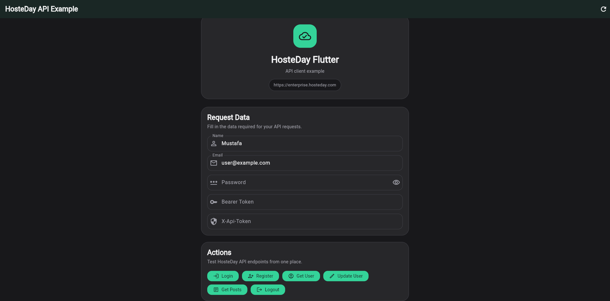

# HosteDay Flutter

A simple Flutter package for connecting your app with HosteDay APIs.

Use it to send requests to your HosteDay backend such as login, registration, profile update, user data, logout, email verification, and custom API endpoints.



## Installation

Install the package from pub.dev:

```bash
flutter pub add hosteday_flutter
```

Then import it:

```dart
import 'package:hosteday_flutter/hosteday_flutter.dart';
```

## Setup

Create the HosteDay client once before running your app:

```dart
import 'package:flutter/material.dart';
import 'package:hosteday_flutter/hosteday_flutter.dart';

late final HosteDayClient hosteday;

void main() {
  hosteday = HosteDayClient(
    config: const HosteDayConfig(
      baseUrl: 'https://example.hosteday.com',
    ),
  );

  runApp(const App());
}
```

Replace `https://example.hosteday.com` with your HosteDay project URL.

## Default API Paths

The package includes default API paths that can be used directly from `hosteday.config`.

The final request URL is built from:

```txt
baseUrl + path
```

For example:

```txt
https://example.hosteday.com/api/auth/login
```

### Auth

| Purpose         | Method | Config path                              | Default path                |
| --------------- | -----: | ---------------------------------------- | --------------------------- |
| Login           |   POST | `hosteday.config.loginPathPost`          | `/api/auth/login`           |
| Register        |   POST | `hosteday.config.registerPathPost`       | `/api/auth/register`        |
| Forgot password |   POST | `hosteday.config.forgotPasswordPathPost` | `/api/auth/forgot-password` |
| Reset password  |   POST | `hosteday.config.resetPasswordPathPost`  | `/api/auth/reset-password`  |

### User

| Purpose       | Method | Config path                                | Default path        |
| ------------- | -----: | ------------------------------------------ | ------------------- |
| Get user      |    GET | `hosteday.config.userShowPathGet`          | `/api/user`         |
| Update user   |    PUT | `hosteday.config.userUpdatePathPut`        | `/api/user`         |
| Update avatar |   POST | `hosteday.config.userUpdateAvatarPathPost` | `/api/user/avatar`  |
| Delete user   | DELETE | `hosteday.config.userDeletePathDelete`     | `/api/user`         |
| Logout        |   POST | `hosteday.config.logoutPathPost`           | `/api/logout`       |
| Email verify  |   POST | `hosteday.config.emailVerifyPathPost`      | `/api/email/verify` |

### Realtime

| Purpose           | Method | Config path                            | Default path                    |
| ----------------- | -----: | -------------------------------------- | ------------------------------- |
| Public events     |   POST | `hosteday.config.publicEventsPath`     | `/api/realtime/events`          |
| Private events    |   POST | `hosteday.config.privateEventsPath`    | `/api/realtime/private-events`  |
| Broadcasting auth |   POST | `hosteday.config.broadcastingAuthPath` | `/api/broadcasting/auth-manual` |

## Basic Example

```dart
final response = await hosteday.get(
  hosteday.config.userShowPathGet,
);

print(response);
```

## Login

```dart
final response = await hosteday.post(
  hosteday.config.loginPathPost,
  body: {
    'email': 'user@example.com',
    'password': 'password',
  },
);

print(response);
```

Example response:

```json
{
  "token": "USER_TOKEN_HERE",
  "user": {
    "id": 1,
    "name": "Mustafa",
    "email": "user@example.com"
  }
}
```

## Register

```dart
final response = await hosteday.post(
  hosteday.config.registerPathPost,
  body: {
    'name': 'Mustafa',
    'email': 'user@example.com',
    'password': 'password',
  },
);

print(response);
```

## Forgot Password

```dart
final response = await hosteday.post(
  hosteday.config.forgotPasswordPathPost,
  body: {
    'email': 'user@example.com',
  },
);

print(response);
```

## Reset Password

```dart
final response = await hosteday.post(
  hosteday.config.resetPasswordPathPost,
  body: {
    'email': 'user@example.com',
    'token': 'RESET_TOKEN',
    'password': 'new-password',
  },
);

print(response);
```

## Get Token From Login Response

```dart
String? extractToken(Map<String, dynamic> response) {
  final token = response['token'] ?? response['access_token'];

  if (token != null) {
    return token.toString();
  }

  final data = response['data'];

  if (data is Map) {
    final nestedToken = data['token'] ?? data['access_token'];

    if (nestedToken != null) {
      return nestedToken.toString();
    }
  }

  return null;
}
```

Usage:

```dart
final response = await hosteday.post(
  hosteday.config.loginPathPost,
  body: {
    'email': 'user@example.com',
    'password': 'password',
  },
);

final token = extractToken(response);

print(token);
```

## Authenticated Request

For protected API routes, pass the token in the request headers:

```dart
final response = await hosteday.get(
  hosteday.config.userShowPathGet,
  headers: {
    'Authorization': 'Bearer USER_TOKEN_HERE',
  },
);

print(response);
```

## Protected Routes With `X-Api-Token`

Some HosteDay projects may enable **Link Protection** to prevent unauthorized access to API routes.

When Link Protection is enabled, protected requests may require two headers:

* `Authorization`: the user Bearer token.
* `X-Api-Token`: the project API token.

Example:

```dart
final response = await hosteday.get(
  hosteday.config.userShowPathGet,
  headers: {
    'Authorization': 'Bearer USER_TOKEN_HERE',
    'X-Api-Token': 'PROJECT_API_TOKEN_HERE',
  },
);

print(response);
```

You can also use the same headers with `POST`, `PUT`, `PATCH`, or `DELETE`.

Example updating user data:

```dart
final response = await hosteday.put(
  hosteday.config.userUpdatePathPut,
  body: {
    'name': 'Mustafa',
    'email': 'user@example.com',
    'password': 'new-password',
  },
  headers: {
    'Authorization': 'Bearer USER_TOKEN_HERE',
    'X-Api-Token': 'PROJECT_API_TOKEN_HERE',
  },
);

print(response);
```

Example login or register request with `X-Api-Token`:

```dart
final response = await hosteday.post(
  hosteday.config.loginPathPost,
  body: {
    'email': 'user@example.com',
    'password': 'password',
  },
  headers: {
    'X-Api-Token': 'PROJECT_API_TOKEN_HERE',
  },
);

print(response);
```

> Do not expose real production tokens inside your source code or public repositories. Store sensitive tokens securely and use environment-based configuration when possible.

## Get User

```dart
final response = await hosteday.get(
  hosteday.config.userShowPathGet,
  headers: {
    'Authorization': 'Bearer USER_TOKEN_HERE',
  },
);

print(response);
```

## Update User

```dart
final response = await hosteday.put(
  hosteday.config.userUpdatePathPut,
  body: {
    'name': 'Mustafa',
    'email': 'user@example.com',
    'password': 'new-password',
  },
  headers: {
    'Authorization': 'Bearer USER_TOKEN_HERE',
  },
);

print(response);
```

## Update User Avatar

```dart
final response = await hosteday.post(
  hosteday.config.userUpdateAvatarPathPost,
  body: {
    'avatar': 'AVATAR_VALUE',
  },
  headers: {
    'Authorization': 'Bearer USER_TOKEN_HERE',
  },
);

print(response);
```

## Logout

```dart
final response = await hosteday.post(
  hosteday.config.logoutPathPost,
  headers: {
    'Authorization': 'Bearer USER_TOKEN_HERE',
  },
);

print(response);
```

## Delete User

```dart
final response = await hosteday.delete(
  hosteday.config.userDeletePathDelete,
  headers: {
    'Authorization': 'Bearer USER_TOKEN_HERE',
  },
);

print(response);
```

## Email Verification

```dart
final response = await hosteday.post(
  hosteday.config.emailVerifyPathPost,
  body: {
    'code': '123456',
  },
  headers: {
    'Authorization': 'Bearer USER_TOKEN_HERE',
  },
);

print(response);
```

## Custom API Request

You can also use any custom endpoint from your HosteDay backend:

```dart
final response = await hosteday.post(
  '/api/items',
  body: {
    'title': 'New Item',
    'description': 'Item description',
  },
  headers: {
    'Authorization': 'Bearer USER_TOKEN_HERE',
  },
);

print(response);
```

## Supported Methods

```dart
hosteday.get('/api/path');

hosteday.post(
  '/api/path',
  body: {},
);

hosteday.put(
  '/api/path',
  body: {},
);

hosteday.patch(
  '/api/path',
  body: {},
);

hosteday.delete('/api/path');
```

## Error Handling

```dart
try {
  final response = await hosteday.get(
    hosteday.config.userShowPathGet,
    headers: {
      'Authorization': 'Bearer USER_TOKEN_HERE',
    },
  );

  print(response);
} on HosteDayException catch (e) {
  print(e.message);
  print(e.statusCode);
  print(e.error);
} catch (e) {
  print(e);
}
```

## Example App

A complete Flutter example is available here:

[View the example](example/lib/main.dart)

## Notes

* Replace `https://example.hosteday.com` with your real HosteDay project URL.
* Use `POST` for login, registration, logout, and creating data.
* Use `GET` for reading data.
* Use `PUT` or `PATCH` for updating data.
* Use `DELETE` for deleting data.
* Use the `Authorization` header for protected routes.
* Do not hard-code production tokens inside your source code.
* You can use the default paths or pass any custom API path directly.
